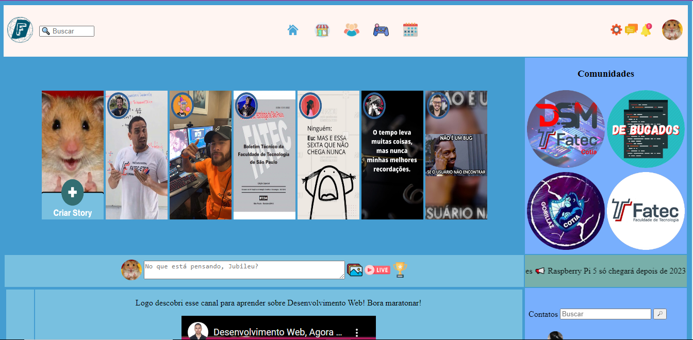
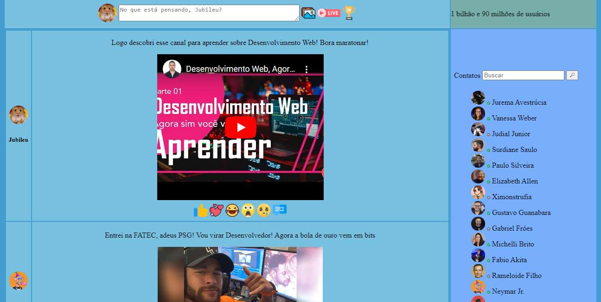
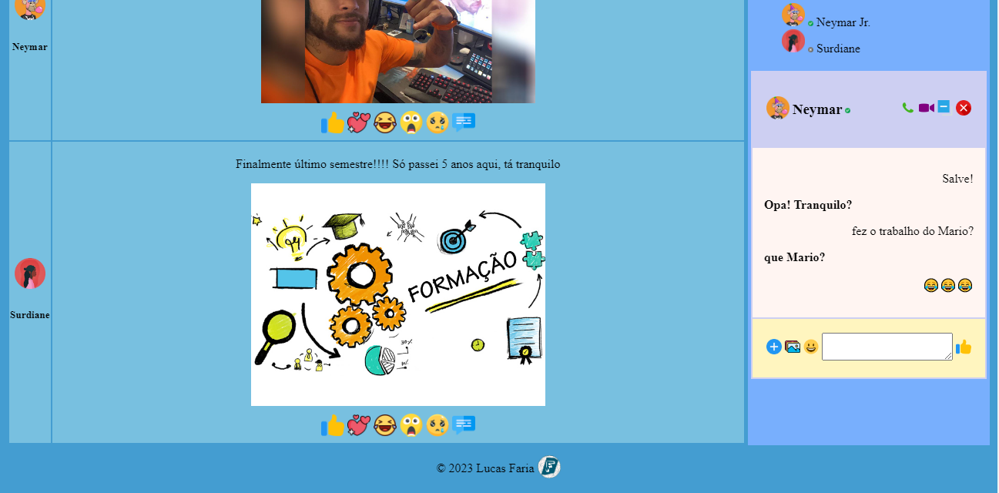

<h1>Titulo ou Arte do Projeto</h1> 

  

> Status do Projeto: Concluido

### Tópicos 

:small_blue_diamond: [Descrição do projeto](#descrição-do-projeto)

:small_blue_diamond: [Desafios](#desafios)

:small_blue_diamond: [Prints](#prints)

:small_blue_diamond: [deploy](#deploy)

## Descrição do projeto 

  Proposta de projeto para criação de uma página utilizando apenas html, sem o 'auxílio' de CSS e/ou JS.
  Dessa forma utilizando das tags e atributos do HTML para melhor fixação.
  Implementei uma solução para o desafio criando o modelo de uma página home de uma rede social voltada para a instituição de ensino na qual houve a proposta do projeto, baseando-se numa estrutura semelhante ao facebook.

  

  <strong>Ementa: </strong>  Linguagem de marcação de hipertexto para estruturação de conteúdo. Tecnologias para estilização de conteúdo. Esquemas de posicionamento. Construção 27 de layout. Framework para desenvolvimento responsivo e página única. Noções de linguagens de script aplicadas à interatividade do usuário com um Front-End. Processamento script lado cliente/servidor. Biblioteca Javascript cross-browser. Sistemas de gestão de configuração de código-fonte. Utilização de servidores de desenvolvimento para implantação local de sistemas web. Controle de versionamento.
  <strong></strong>

## desafios

:heavy_check_mark: Utilizar apenas html  

:heavy_check_mark: criar um layout sem utilização de estilos de CSS 

:heavy_check_mark: imaginar e implementar uma solução 

## prints:

## deploy

:warning: [Git Pages](https://lucasfariadev.github.io/fatecanos_site/)

Copyright :copyright: 2023 - Fatecanos_Site
